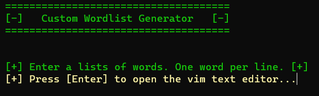
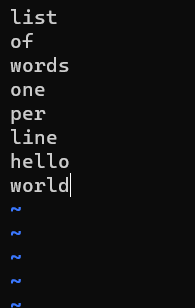
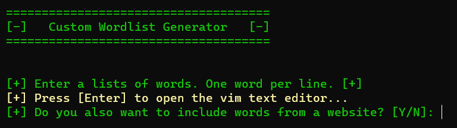
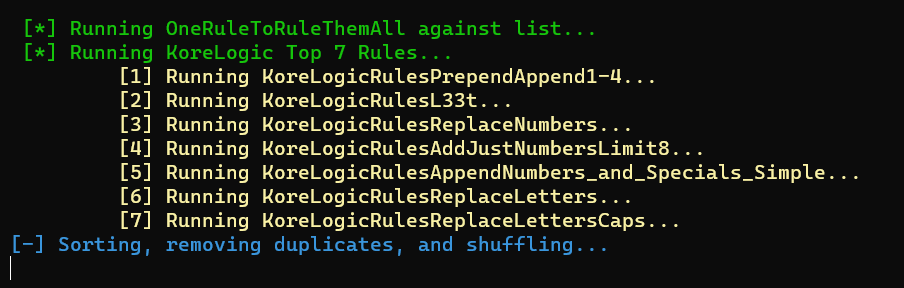
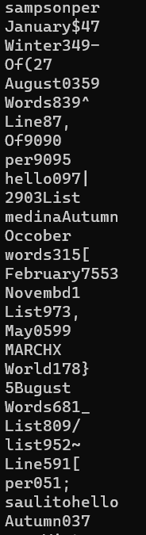

# Custom Wordlist Generator

Wordlist Generator script.

## Description

Custom wordlist generator that can be used for PenTest engagements or any other engagements. It runs a list of words through hashcat and john rules with the option to scrape a web site using cewl.

## Getting Started

### Dependencies

* CeWL (Custom Word List generator)
* OneRuleToRuleThemAll.rule
* KoreLogic-Rules  

### Installing

1. `sudo git clone https://github.com/a13xdagr8/custom-wordlist-generator.git`
2. `cd custom-wordlist-generator`
3. `sudo chmod +x custom-wordlist-generator.sh`

### Executing program

1. `cd` to custom-wordlist-generator
2. `sudo ./custom-wordlist-generator.sh`

## Help

The script execution may take a while depending on how many words the list has and if a web site is scapped. Also, how fast or slow your machine is.

Because of the way the `sort` command works, sort will take a while to complete. Just sit back and drink more coffee.

## Screenshots

*Example*

